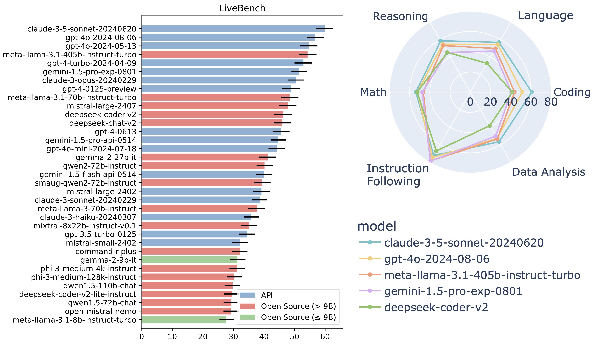

# LiveBench (en inglés)


<p align="center">
    <a href="https://livebench.ai/"> Tabla de clasificación</a> •
    <a href="https://huggingface.co/livebench"> Datos </a> •
    <a href="https://livebench.ai/livebench.pdf"> Papel</a> 
</p>

Las mejores modelos a partir del 6 de agosto de 2024 (consulta la tabla de clasificación completa [aquí](https://livebench.ai/)):



**Actualización 28 de julio de 2024:** La primera actualización mensual. Agregamos 50 preguntas en una nueva tarea de razonamiento espacial, 28 preguntas adicionales de generación de codificación y 12 preguntas adicionales de finalización de codificación. Además, fusionamos una de las dependencias opcionales en pyproject.toml en el flujo de dependencias principal para resolver un problema experimentado al usar `gen_api_answer.py` sin instalar paquetes como torch.

## Tabla de contenidos

- [Introducción](#introduction)
- [Inicio rápido de la instalación](#installation-quickstart)
- [Uso](#usage)
- [Datos](#data)
- [Adición de nuevas preguntas](#adding-new-questions)
- [Documentación](#documentation)
- [Cita](#citation)

## Introducción

Presentamos LiveBench: un punto de referencia para LLM diseñado teniendo en cuenta la contaminación del conjunto de pruebas y la evaluación objetiva.

LiveBench tiene las siguientes propiedades:

* LiveBench está diseñado para limitar la contaminación potencial mediante la publicación de nuevas preguntas mensualmente, así como preguntas basadas en conjuntos de datos recientemente publicados, documentos de arXiv, artículos de noticias y sinopsis de películas de IMDb.
* Cada pregunta tiene respuestas verificables, objetivas y basadas en la verdad, lo que permite que las preguntas difíciles se califiquen de manera precisa y automática, sin el uso de un juez de LLM.
* LiveBench contiene actualmente un conjunto de 18 tareas diversas en 6 categorías, y lanzaremos nuevas tareas más difíciles con el tiempo.

**¡Evaluaremos tu modelo!** ¡Abra un [número](https://github.com/LiveBench/LiveBench/issues) o envíenos un correo electrónico a [livebench.ai@gmail.com](mailto:livebench.ai@gmail.com)!

## Inicio rápido de la instalación

Probado en Python 3.10

Para generar respuestas con modelos de API (es decir, con gen_api_answer.py), realizar juicios y mostrar resultados:

```bash
cd LiveBench
pip install -e .
```

Para hacer todo lo anterior y también generar respuestas con inferencia de GPU local en modelos de código abierto (es decir, con gen_model_answer.py):
```bash
cd LiveBench
pip install -e .[flash_attn]
```

**Nota sobre fschat**: La versión del paquete fschat en pip (es decir, [lmsys/fastchat](https://github.com/lm-sys/FastChat)) está actualmente desactualizada, por lo que recomendamos encarecidamente `pip uninstall fschat` antes de ejecutar lo anterior, ya que entonces instalará automáticamente una confirmación más reciente de fastchat.

Nuestro repositorio está adaptado del excelente módulo de llm_judge de FastChat [](https://github.com/lm-sys/FastChat/tree/main/fastchat/llm_judge) , y también contiene código de [LiveCodeBench](https://github.com/LiveCodeBench/LiveCodeBench) e [IFEval](https://github.com/Rohan2002/IFEval?tab=readme-ov-file).

## Uso

```bash
cd livebench
```

Para generar respuestas de modelo en LiveBench, ejecute:
```bash
python gen_model_answer.py --model-path /path/to/Mistral-7B-Instruct-v0.2/ --model-id Mistral-7B-Instruct-v0.2 --dtype bfloat16 --bench-name live_bench
```

En el caso de los modelos basados en API, primero establezca la clave adecuada y, a continuación, ejecute el archivo `gen_api_answer.py`. Actualmente admitimos las siguientes API: OpenAI, Anthropic, Mistral, Cohere y Gemini. El comando para ejecutar todo LiveBench en un `api_model_name`, ejecute este comando:
```bash
export OPENAI_API_KEY=<your_key>
export ANTHROPIC_API_KEY=<your_key>
export MISTRAL_API_KEY=<your_key>
export CO_API_KEY=<your_key>
export GEMINI_API_KEY=<your_key>
export DEEPSEEK_API_KEY=<your_key>
python gen_api_answer.py --model <api_model_name> --bench-name live_bench
```

Para generar respuestas de modelo con VLLM u otras API arbitrarias que coincidan con el formato de API de OpenAI, ejecute:
```bash
export LIVEBENCH_API_KEY=<your API key if needed. Usually not needed for VLLM>
python gen_api_answer.py --model <api_model_name> --bench-name live_bench --api-base <your endpoint. Often, for VLLM, this is http://localhost:8000/v1>
```

Para puntuar los resultados del modelo:

```bash
python gen_ground_truth_judgment.py --bench-name live_bench
```

Para mostrar todos los resultados:
```bash
python show_livebench_result.py
```

Es posible que desee ejecutar estos comandos solo en algunos modelos. Para ejecutar cualquiera de los archivos python anteriores (`gen_model_answer.py`, `gen_api_answer.py`, `gen_ground_truth_judgment`, o `show_livebench_result.py`) para modelos específicos, utilice los siguientes estilos de argumentos:
```bash
python gen_model_answer.py          --bench-name live_bench --model-path /path/to/Mistral-7B-Instruct-v0.2/ --model-id Mistral-7B-Instruct-v0.2 --dtype bfloat16 
python gen_api_answer.py            --bench-name live_bench --model gpt-4-turbo
python gen_ground_truth_judgment.py --bench-name live_bench --model-list Mistral-7B-Instruct-v0.2 Llama-2-7b-chat-hf claude-3-opus-20240229
python show_livebench_result.py    --bench-name live_bench --model-list Mistral-7B-Instruct-v0.2 Llama-2-7b-chat-hf claude-3-opus-20240229
```

O bien, es posible que desee mostrar los resultados de una categoría o tarea específica de LiveBench mediante el `--bench-name` argumento. Aquí, nos ejecutamos `show_livebench_result.py` solo en la `web_of_lies_v2` tarea: 
```bash
python show_livebench_result.py --bench-name live_bench/reasoning/web_of_lies_v2
```

De forma predeterminada, cualquiera de los scripts anteriores utilizará todas las preguntas de livebench publicadas hasta ahora. Ninguna de las preguntas de Livebench ha sido oficialmente obsoleta/excluida. Opcionalmente, puede especificar el `--livebench-releases` arg para restringir las preguntas que utiliza para agregarlas en versiones específicas.

Para usar todas las preguntas:
```bash
python gen_api_answer.py --bench-name live_bench --model gpt-4-turbo --livebench-releases 2024-07-26 2024-06-24
```

Para usar solo las preguntas de la actualización de julio de 2024:
```bash
python gen_api_answer.py --bench-name live_bench --model gpt-4-turbo --livebench-releases 2024-07-26
```

Para descargar opcionalmente `question.jsonl` archivos (para inspección) y archivos de respuestas/juicios de la tabla de clasificación, use
```bash
python download_questions.py
python download_leaderboard.py
```

Para usar `question.jsonl` archivos en lugar de huggingface, establezca `--question-source jsonl` en `gen_api_answer.py`, `gen_model_answer.py`, y `gen_ground_truth_judgment.py`. Esta también es una característica útil si desea modificar los jsonls de las preguntas o experimentar con sus propias preguntas.

## Datos
Las preguntas para cada una de las categorías se pueden encontrar a continuación:
- [Razonamiento](https://huggingface.co/datasets/livebench/reasoning)
- [Matemática](https://huggingface.co/datasets/livebench/math)
- [Codificación](https://huggingface.co/datasets/livebench/coding)
- [Idioma](https://huggingface.co/datasets/livebench/language)
- [Análisis de datos](https://huggingface.co/datasets/livebench/data_analysis)
- [Instrucciones siguientes](https://huggingface.co/datasets/livebench/instruction_following)

También están disponibles las [respuestas modelo](https://huggingface.co/datasets/livebench/model_answer) y los [juicios modelo.](https://huggingface.co/datasets/livebench/model_judgment)

## Adición de nuevas preguntas
Si desea crear su propio conjunto de preguntas, o probar diferentes indicaciones, etcétera, siga estos pasos:

- Cree un `question.jsonl` archivo con la siguiente ruta: `livebench/data/live_bench/<category>/<task>/question.jsonl`. Por ejemplo, `livebench/data/reasoning/web_of_lies_new_prompt/question.jsonl`. A continuación, se muestra un ejemplo del formato para `question.jsonl` (son las primeras preguntas de [web_of_lies_v2](https://huggingface.co/datasets/livebench/reasoning)):

```jsonl
{"question_id": "0daa7ca38beec4441b9d5c04d0b98912322926f0a3ac28a5097889d4ed83506f", "category": "reasoning", "ground_truth": "no, yes, yes", "turns": ["In this question, assume each person either always tells the truth or always lies. Tala is at the movie theater. The person at the restaurant says the person at the aquarium lies. Ayaan is at the aquarium. Ryan is at the botanical garden. The person at the park says the person at the art gallery lies. The person at the museum tells the truth. Zara is at the museum. Jake is at the art gallery. The person at the art gallery says the person at the theater lies. Beatriz is at the park. The person at the movie theater says the person at the train station lies. Nadia is at the campground. The person at the campground says the person at the art gallery tells the truth. The person at the theater lies. The person at the amusement park says the person at the aquarium tells the truth. Grace is at the restaurant. The person at the aquarium thinks their friend is lying. Nia is at the theater. Kehinde is at the train station. The person at the theater thinks their friend is lying. The person at the botanical garden says the person at the train station tells the truth. The person at the aquarium says the person at the campground tells the truth. The person at the aquarium saw a firetruck. The person at the train station says the person at the amusement park lies. Mateo is at the amusement park. Does the person at the train station tell the truth? Does the person at the amusement park tell the truth? Does the person at the aquarium tell the truth? Think step by step, and then put your answer in **bold** as a list of three words, yes or no (for example, **yes, no, yes**). If you don't know, guess."], "task": "web_of_lies_v2"}
{"question_id": "9ee37b9a04ab050936c86b2c5bb7abbaa0bc0e737d59a7bff9ba11e9b4069c1d", "category": "reasoning", "ground_truth": "yes, no, yes", "turns": ["In this question, assume each person either always tells the truth or always lies. Liam is at the movie theater. The person at the beach says the person at the restaurant tells the truth. Kehinde is at the aquarium. The person at the amusement park saw a firetruck. The person at the aquarium tells the truth. Luna is at the library. Jaxon is at the amusement park. The person at the amusement park says the person at the beach tells the truth. Anika is at the restaurant. The person at the barbershop tells the truth. The person at the observatory says the person at the planetarium lies. Hiroshi is at the beach. Isabella is at the planetarium. Nia is at the barbershop. The person at the movie theater says the person at the observatory lies. The person at the restaurant tells the truth. Max is at the observatory. The person at the library says the person at the amusement park tells the truth. The person at the planetarium says the person at the library tells the truth. Does the person at the movie theater tell the truth? Does the person at the observatory tell the truth? Does the person at the planetarium tell the truth? Think step by step, and then put your answer in **bold** as a list of three words, yes or no (for example, **yes, no, yes**). If you don't know, guess."], "task": "web_of_lies_v2"}
{"question_id": "d7071c9ff5d9779e7ab955366d0ae8db40f785aadfe7ff0b5a7ede98c05c44ea", "category": "reasoning", "ground_truth": "no, no, yes", "turns": ["In this question, assume each person either always tells the truth or always lies. Liam is at the restaurant. The person at the observatory says the person at the botanical garden lies. Elowen is at the vineyard. The person at the library says the person at the botanical garden tells the truth. The person at the train station tells the truth. The person at the botanical garden saw a firetruck. The person at the botanical garden says the person at the train station lies. Jake is at the aquarium. Soren is at the farm. Theo is at the gym. The person at the train station saw a firetruck. Devika is at the train station. Kehinde is at the library. The person at the restaurant lies. The person at the farm says the person at the train station lies. The person at the gym says the person at the train station lies. Hiroshi is at the botanical garden. The person at the vineyard lies. The person at the aquarium says the person at the library tells the truth. Quan is at the observatory. Does the person at the library tell the truth? Does the person at the botanical garden tell the truth? Does the person at the train station tell the truth? Think step by step, and then put your answer in **bold** as a list of three words, yes or no (for example, **yes, no, yes**). If you don't know, guess."], "task": "web_of_lies_v2"}
{"question_id": "92bb60ed8fe8f01ae8ed962c504f73b598e541a89fcb2d800685230220f44bd8", "category": "reasoning", "ground_truth": "yes, no, no", "turns": ["In this question, assume each person either always tells the truth or always lies. The person at the theater says the person at the airport lies. The person at the barbershop says the person at the school tells the truth. Hiroshi is at the school. Ryan is at the airport. Zara is at the botanical garden. The person at the train station tells the truth. Jake is at the observatory. The person at the airport thinks their friend is lying. Theo is at the theater. The person at the botanical garden says the person at the aquarium lies. Liam is at the train station. Grace is at the bowling alley. The person at the airport says the person at the bowling alley lies. Olivia is at the amusement park. The person at the observatory tells the truth. Elowen is at the aquarium. Farid is at the art gallery. The person at the airport says the person at the beach tells the truth. The person at the art gallery says the person at the barbershop lies. The person at the bowling alley says the person at the art gallery lies. Soren is at the barbershop. The person at the school tells the truth. The person at the aquarium says the person at the airport tells the truth. The person at the botanical garden saw a firetruck. The person at the bowling alley says the person at the amusement park tells the truth. The person at the airport saw a firetruck. Ayaan is at the beach. Does the person at the botanical garden tell the truth? Does the person at the aquarium tell the truth? Does the person at the airport tell the truth? Think step by step, and then put your answer in **bold** as a list of three words, yes or no (for example, **yes, no, yes**). If you don't know, guess."], "task": "web_of_lies_v2"}
{"question_id": "36febbb33b3d28b8f75e1a7f798fcff09903e94a50b89da2dbf1ed160508c02c", "category": "reasoning", "ground_truth": "yes, yes, yes", "turns": ["In this question, assume each person either always tells the truth or always lies. Beatriz is at the vineyard. The person at the city hall says the person at the school lies. The person at the ice skating rink says the person at the school tells the truth. Quan is at the ice skating rink. The person at the amusement park says the person at the school tells the truth. Olivia is at the restaurant. The person at the vineyard says the person at the botanical garden tells the truth. The person at the vineyard says the person at the campground tells the truth. Charlie is at the campground. Soren is at the school. Grace is at the barbershop. The person at the school says the person at the vineyard tells the truth. The person at the barbershop says the person at the campground tells the truth. Mateo is at the amusement park. Tala is at the botanical garden. The person at the campground tells the truth. The person at the restaurant tells the truth. Devika is at the city hall. The person at the amusement park thinks their neighbor is telling the truth. The person at the amusement park thinks their friend is lying. Does the person at the amusement park tell the truth? Does the person at the school tell the truth? Does the person at the vineyard tell the truth? Think step by step, and then put your answer in **bold** as a list of three words, yes or no (for example, **yes, no, yes**). If you don't know, guess."], "task": "web_of_lies_v2"}
```

- Cree un nuevo método de puntuación en la `process_results` carpeta. Si es similar a una tarea existente, puede copiar la función de puntuación de esa tarea. Por ejemplo, `livebench/process_results/reasoning/web_of_lies_new_prompt/utils.py` puede ser una copia del método de `web_of_lies_v2` puntuación.
- Agregue la función de puntuación aquí `gen_ground_truth_judgment.py` [](https://github.com/LiveBench/LiveBench/blob/93e3a7d4fa5bb164ef4cb58f67683e4e54554af9/livebench/gen_ground_truth_judgment.py#L124).

- Ejecute y puntúe modelos mediante el `question-source jsonl` y especificando la tarea. Por ejemplo: 
```bash 
python gen_api_answer.py --bench-name live_bench/reasoning/web_of_lies_new_prompt --model claude-3-5-sonnet-20240620 --question-source jsonl
python gen_ground_truth_judgment.py --bench-name live_bench/reasoning/web_of_lies_new_prompt --question-source jsonl
python show_livebench_result.py --bench-name live_bench/reasoning/web_of_lies_new_prompt
```

## Documentación
Aquí, describimos la documentación de nuestro conjunto de datos. Esta información también está disponible en nuestro documento.
- [Responsabilidad del autor](docs/AUTHOR_RESPONSIBILITY.md)
- [Código de Conducta](docs/CODE_OF_CONDUCT.md)
- [Contribuyendo](docs/CONTRIBUTING.md)
- [Hoja de datos de LiveBench](docs/DATASHEET.md)
- [Plan de mantenimiento](docs/MAINTENANCE_PLAN.md)

## Cita

```bibtex
@article{livebench,
  author    = {White, Colin and Dooley, Samuel and Roberts, Manley and Pal, Arka and Feuer, Ben and Jain, Siddhartha and Shwartz-Ziv, Ravid and Jain, Neel and Saifullah, Khalid and Naidu, Siddartha and Hegde, Chinmay and LeCun, Yann and Goldstein, Tom and Neiswanger, Willie and Goldblum, Micah},
  title     = {LiveBench: A Challenging, Contamination-Free LLM Benchmark},
  url       = {arXiv preprint arXiv:2406.19314},
  year      = {2024},
}
```
