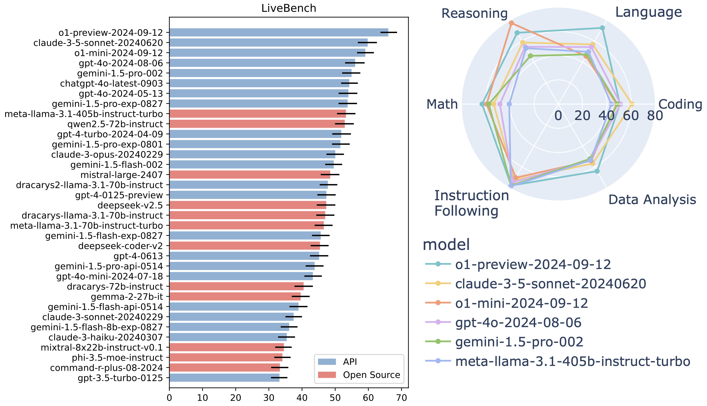

# LiveBench


<p align="center">
    <a href="https://livebench.ai/">🏆 Leaderboard</a> •
    <a href="https://huggingface.co/livebench">💻 Data </a> •
    <a href="https://livebench.ai/livebench.pdf">📝 Paper</a> 
</p>

Top models as of 30th September 2024 (see the full leaderboard [here](https://livebench.ai/)):



Please see the [changelog](changelog.md) for details about each LiveBench release.

## Table of Contents

- [Introduction](#introduction)
- [Installation Quickstart](#installation-quickstart)
- [Usage](#usage)
- [Data](#data)
- [Adding New Questions](#adding-new-questions)
- [Adding New Models](#adding-new-models)
- [Documentation](#documentation)
- [Citation](#citation)

## Introduction

Introducing LiveBench: a benchmark for LLMs designed with test set contamination and objective evaluation in mind.

LiveBench has the following properties:

* LiveBench is designed to limit potential contamination by releasing new questions monthly, as well as having questions based on recently-released datasets, arXiv papers, news articles, and IMDb movie synopses.
* Each question has verifiable, objective ground-truth answers, allowing hard questions to be scored accurately and automatically, without the use of an LLM judge.
* LiveBench currently contains a set of 18 diverse tasks across 6 categories, and we will release new, harder tasks over time.

**We will evaluate your model!** Open an [issue](https://github.com/LiveBench/LiveBench/issues) or email us at [livebench.ai@gmail.com](mailto:livebench.ai@gmail.com)!

## Installation Quickstart

Tested on Python 3.10.

We recommend using a virtual environment to install LiveBench.
```bash
python -m venv .venv
source .venv/bin/activate
```

To generate answers with API models (i.e. with `gen_api_answer.py`), conduct judgments, and show results:

```bash
cd LiveBench
pip install -e .
```

To do all of the above and also generate answers with local GPU inference on open source models (i.e. with gen_model_answer.py):
```bash
cd LiveBench
pip install -e .[flash_attn]
```

**Note about fschat**: The fschat package version on pip (i.e., [lmsys/fastchat](https://github.com/lm-sys/FastChat)) is currently out of date, so we strongly recommend `pip uninstall fschat` before running the above, since it will then automatically install a more recent commit of fastchat.

Our repo is adapted from FastChat's excellent [llm_judge](https://github.com/lm-sys/FastChat/tree/main/fastchat/llm_judge) module, and it also contains code from [LiveCodeBench](https://github.com/LiveCodeBench/LiveCodeBench) and [IFEval](https://github.com/Rohan2002/IFEval?tab=readme-ov-file).

## Usage

```bash
cd livebench
```

### Bash Scripts

The simplest way to run LiveBench inference and scoring is by using our provided Bash scripts. These scripts automate the process of generating and scoring model responses, and can automatically parallelize runs of different tasks or categories to speed up execution for models with higher rate limits.

#### Basic
To evaluate a single subset of LiveBench for a single model, do:
```
./scripts/run_livebench <bench-name> <model> <question-source> 
```
e.g. `./scripts/run_livebench live_bench/coding gpt-4o-mini` will evaluate gpt-4o-mini on all the coding tasks. `<question-source>` is optional and defaults to `huggingface`.

If you'd like to run multiple LiveBench subsets in sequence, use
```
./scripts/run_livebench_sequential <model> <venv-path> <question-source>
```
where `<venv-path>` is a relative path to your `venv/bin/activate` script. The list of benchmarks to be evaluated can be viewed inside the script.

For a local-weight model, use
```
./scripts/run_livebench_sequential_local_model <model-path> <model-id> <venv-path> <question-source>
```

#### Parallel
For API-based models with high rate limits, evaluation of LiveBench can be sped up by evaluating different tasks in parallel. To do this automatically, run
```
./scripts/run_livebench_parallel <model> <venv-path> <question-source>
```
The set of categories or tasks to be evaluated is editable in `./scripts/run_livebench_parallel`. This script will spawn a tmux session, with each LiveBench process in a separate pane, so progress on all can be viewed at once. This setup will also persist on a remote server (i.e. through SSH) so that connection interrupts will not cancel the processes.

If you'd like to start evaluation of multiple models at once, run
```
./scripts/run_livebench_parallel_models <venv-path> <question-source>
```
You can edit the list of models to be evaluated in the script file. This script runs `run_livebench_parallel` once for each model.

Note: After the evaluation has completed, you will need to run `show_livebench_result.py` manually to view the leaderboard.

### Python Scripts

If you'd like, you can manually execute the Python scripts used to evaluate LiveBench.

In all scripts, the `--bench-name` argument is used to specify the subset of questions to use.
Setting `--bench-name` to `live_bench` will use all questions.
Setting `--bench-name` to `live_bench/category` will use all questions in that category.
Setting `--bench-name` to `live_bench/category/task` will use all questions in that task.

The `--question-source` argument is used to specify the source of questions; by default, it is set to `huggingface`, which uses the questions available on [Huggingface](https://huggingface.co/livebench). See [below](#adding-new-questions) for instructions on how to use your own questions.

The `--livebench-release-option` argument is used to specify the version of livebench to use. By default, it is set to the latest version. Available options are `2024-07-26`, `2024-06-24`, `2024-08-31`, and `2024-11-25`.

#### Performing Inference

##### API-Based Models
Make sure you have the appropriate API keys set as environment variables (e.g. `export OPENAI_API_KEY=<your_key>`). If using a virtual environment, you can add the environment variable export to the `.venv/bin/activate` file.

The `gen_api_answer.py` script is used to generate answers for API-based models. It can be run using the following command:
```bash
python gen_api_answer.py --bench-name <bench-name> --model <model-name> --question-source <question-source> --livebench-release-option <livebench-release-option>
```
Only the `--model` argument is required. For example, to run coding tasks for gpt-4o-mini, run:
```bash
python gen_api_answer.py --bench-name live_bench/coding --model gpt-4o-mini
```

If your model uses an OpenAI API endpoint, you can specify the endpoint using the `--api-base` argument. For example, to evaluate gpt-4o-mini using a VLLM endpoint, run:
```bash
python gen_api_answer.py --model gpt-4o-mini --api-base http://localhost:8000/v1
```
In this case, if an API key is needed, you should set the `LIVEBENCH_API_KEY` environment variable.

##### Local Models

To generate answers with local GPU inference on open source models, use the `gen_model_answer.py` script:
```bash
python gen_model_answer.py --model-path <path-to-model> --model-id <model-id> --bench-name <bench-name>
```
`<path-to-model>` should be either a path to a local model weight folder or a HuggingFace repo ID. `<model-id>` will be the name of the model on the leaderboard and the identifier used for other scripts.

Other arguments are optional, but you may want to set `--num-gpus-per-model` and `--num-gpus-total` to match the number of GPUs you have available. You may also want to set `--dtype` to match the dtype of your model weights.

 Run `python gen_model_answer.py --help` for more details.

#### Scoring Outputs

To score the outputs of your model, run the `gen_ground_truth_judgment.py` script:
```bash
python gen_ground_truth_judgment.py --bench-name <bench-name> --model-list <model-list>
```
`<model-list>` is a space-separated list of model IDs to score. For example, to score gpt-4o-mini and claude-3-5-sonnet, run:
```bash
python gen_ground_truth_judgment.py --bench-name live_bench --model-list gpt-4o-mini claude-3-5-sonnet
```
If no `--model-list` argument is provided, all models will be scored.

Setting `--debug` will print debug information for individual questions. This can be useful for debugging new tasks.

### Showing Results

To show the results of your model, run the `show_livebench_result.py` script:
```bash
python show_livebench_result.py --bench-name <bench-name> --model-list <model-list>
```
`<model-list>` is a space-separated list of model IDs to show. For example, to show the results of gpt-4o-mini and claude-3-5-sonnet, run:
```bash
python show_livebench_result.py --bench-name live_bench --model-list gpt-4o-mini claude-3-5-sonnet
```
If no `--model-list` argument is provided, all models will be shown.

The leaderboard will be displayed in the terminal. You can also find the breakdown by category in `all_groups.csv` and by task in `all_tasks.csv`.


### Error Checking

The `scripts/error_check` script will print out questions for which a model's output is `$ERROR$`, which indicates repeated API call failures.
You can use the `scripts/rerun_failed_questions.py` script to rerun the failed questions.

If after multiple attempts, the model's output is still `$ERROR$`, it's likely that the question is triggering some content filter from the model's provider (Gemini models are particularly prone to this). In this case, there is not much that can be done.


## Data
The questions for each of the categories can be found below:
- [Reasoning](https://huggingface.co/datasets/livebench/reasoning)
- [Math](https://huggingface.co/datasets/livebench/math)
- [Coding](https://huggingface.co/datasets/livebench/coding)
- [Language](https://huggingface.co/datasets/livebench/language)
- [Data Analysis](https://huggingface.co/datasets/livebench/data_analysis)
- [Instruction Following](https://huggingface.co/datasets/livebench/instruction_following)

Also available are the [model answers](https://huggingface.co/datasets/livebench/model_answer) and the [model judgments](https://huggingface.co/datasets/livebench/model_judgment).

To download the `question.jsonl` files (for inspection) and answer/judgment files from the leaderboard, use
```bash
python download_questions.py
python download_leaderboard.py
```

Questions will be downloaded to `livebench/data/<category>/question.jsonl`.


## Evaluating New Questions
If you want to create your own set of questions, or try out different prompts, etc, follow these steps:

- Create a `question.jsonl` file with the following path (or, run `python download_questions.py` and update the downloaded file): `livebench/data/live_bench/<category>/<task>/question.jsonl`. For example, `livebench/data/reasoning/web_of_lies_new_prompt/question.jsonl`. Here is an example of the format for `question.jsonl` (it's the first few questions from [web_of_lies_v2](https://huggingface.co/datasets/livebench/reasoning)):

```jsonl
{"question_id": "0daa7ca38beec4441b9d5c04d0b98912322926f0a3ac28a5097889d4ed83506f", "category": "reasoning", "ground_truth": "no, yes, yes", "turns": ["In this question, assume each person either always tells the truth or always lies. Tala is at the movie theater. The person at the restaurant says the person at the aquarium lies. Ayaan is at the aquarium. Ryan is at the botanical garden. The person at the park says the person at the art gallery lies. The person at the museum tells the truth. Zara is at the museum. Jake is at the art gallery. The person at the art gallery says the person at the theater lies. Beatriz is at the park. The person at the movie theater says the person at the train station lies. Nadia is at the campground. The person at the campground says the person at the art gallery tells the truth. The person at the theater lies. The person at the amusement park says the person at the aquarium tells the truth. Grace is at the restaurant. The person at the aquarium thinks their friend is lying. Nia is at the theater. Kehinde is at the train station. The person at the theater thinks their friend is lying. The person at the botanical garden says the person at the train station tells the truth. The person at the aquarium says the person at the campground tells the truth. The person at the aquarium saw a firetruck. The person at the train station says the person at the amusement park lies. Mateo is at the amusement park. Does the person at the train station tell the truth? Does the person at the amusement park tell the truth? Does the person at the aquarium tell the truth? Think step by step, and then put your answer in **bold** as a list of three words, yes or no (for example, **yes, no, yes**). If you don't know, guess."], "task": "web_of_lies_v2"}
```

- If adding a new task, create a new scoring method in the `process_results` folder. If it is similar to an existing task, you can copy that task's scoring function. For example, `livebench/process_results/reasoning/web_of_lies_new_prompt/utils.py` can be a copy of the `web_of_lies_v2` scoring method.
- Add the scoring function to `gen_ground_truth_judgment.py` [here](https://github.com/LiveBench/LiveBench/blob/93e3a7d4fa5bb164ef4cb58f67683e4e54554af9/livebench/gen_ground_truth_judgment.py#L124).

- Run and score models using `--question-source jsonl` and specifying your task. For example: 
```bash 
python gen_api_answer.py --bench-name live_bench/reasoning/web_of_lies_new_prompt --model claude-3-5-sonnet-20240620 --question-source jsonl
python gen_ground_truth_judgment.py --bench-name live_bench/reasoning/web_of_lies_new_prompt --question-source jsonl
python show_livebench_result.py --bench-name live_bench/reasoning/web_of_lies_new_prompt
```

## Evaluating New Models

As discussed above, local model models can be evaluated with `gen_model_answer.py`.

API-based models with an OpenAI-compatible API can be evaluated with `gen_api_answer.py` by setting the `--api-base` argument.

For other models, it will be necessary to update several files depending on the model.

Models for which there is already an API implementation in LiveBench (e.g. OpenAI, Anthropic, Mistral, Google, Amazon, etc.) can be added simply by adding a new entry in `api_models.py`, using the appropriate `Model` subclass (e.g. `OpenAIModel`, `AnthropicModel`, `MistralModel`, `GoogleModel`, `AmazonModel`, etc.).

For other models:

1. Implement a new completion function in `model/completions.py`. This function should take a `Model`, `Conversation`, `temperature`, `max_tokens`, and `kwargs` as arguments, and return a tuple of `(response, tokens_consumed)` after calling the model's API.
2. If necessary, implement a new `ModelAdapter` in `model/model_adapter.py`. This class should implement the `BaseModelAdapter` interface. For many models, existing adapters (such as `ChatGPTAdapter`) will work.
3. Add a new `Model` entry in `model/api_models.py`. This will have the form `Model(api_name=<api_name>, display_name=<display_name>, aliases=[], adapter=<model_adapter>, api_function=<api_function>)`. Make sure to add the new model to the `ALL_MODELS` list.

You should now be able to evaluate the model with `gen_api_answer.py` or other scripts as normal.

## Documentation
Here, we describe our dataset documentation. This information is also available in our paper.
- [Author Responsibility](docs/AUTHOR_RESPONSIBILITY.md)
- [Code of Conduct](docs/CODE_OF_CONDUCT.md)
- [Contributing](docs/CONTRIBUTING.md)
- [Datasheet for LiveBench](docs/DATASHEET.md)
- [Maintenance Plan](docs/MAINTENANCE_PLAN.md)

## Citation

```bibtex
@article{livebench,
  author    = {White, Colin and Dooley, Samuel and Roberts, Manley and Pal, Arka and Feuer, Ben and Jain, Siddhartha and Shwartz-Ziv, Ravid and Jain, Neel and Saifullah, Khalid and Naidu, Siddartha and Hegde, Chinmay and LeCun, Yann and Goldstein, Tom and Neiswanger, Willie and Goldblum, Micah},
  title     = {LiveBench: A Challenging, Contamination-Free LLM Benchmark},
  url       = {arXiv preprint arXiv:2406.19314},
  year      = {2024},
}
```
