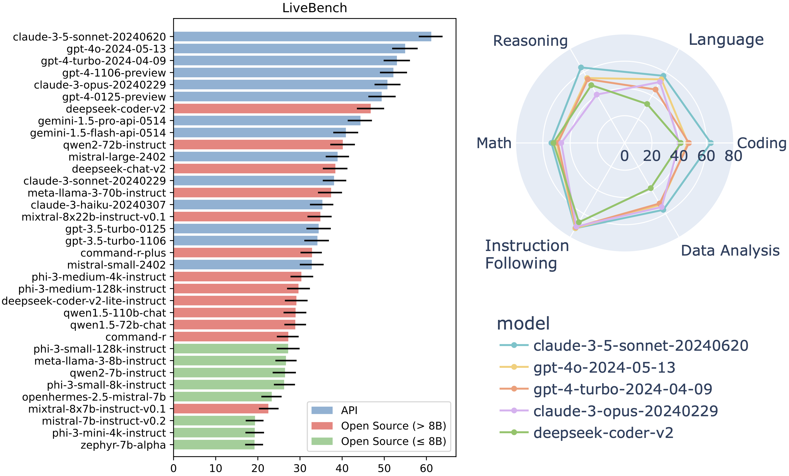

# LiveBench


<p align="center">
    <a href="https://livebench.ai/">🏆 Leaderboard</a> •
    <a href="https://huggingface.co/livebench">💻 Data </a> •
    <a href="https://livebench.ai/livebench.pdf">📝 Paper</a> 
</p>

Leaderboard as of 25th June 2024:



**Update 25th June 2024:** we removed a reasoning sub-task, house_traversal, because of ambiguous parsing causing misleading results. We will replace it in a future release.

## Introduction

Introducing LiveBench: a benchmark for LLMs designed with test set contamination and objective evaluation in mind.

LiveBench has the following properties:

* LiveBench is designed to limit potential contamination by releasing new questions monthly, as well as having questions based on recently-released datasets, arXiv papers, news articles, and IMDb movie synopses.
* Each question has verifiable, objective ground-truth answers, allowing hard questions to be scored accurately and automatically, without the use of an LLM judge.
* LiveBench currently contains a set of 18 diverse tasks across 6 categories, and we will release new, harder tasks over time.

**We will evaluate your model!** Open an [issue](https://github.com/LiveBench/LiveBench/issues) or email us at [mailto:livebench.ai@gmail.com](livebench.ai@gmail.com)!

## Installation Quickstart

Tested on Python 3.10

To generate answers with API models (i.e. with gen_api_answer.py), conduct judgments, and show results:

```bash
cd LiveBench
pip install -e .
```

To do all of the above and also generate answers with local GPU inference on open source models (i.e. with gen_model_answer.py):
```bash
cd LiveBench
pip install -e .[local_models]
pip install -e .[flash_attn]
```

**Note about fschat**: The fschat package version on pip (i.e., [lmsys/fastchat](https://github.com/lm-sys/FastChat)) is currently out of date, so we strongly recommend `pip uninstall fschat` before running the above, since it will then automatically install a more recent commit of fastchat.

Our repo is adapted from FastChat's excellent [llm_judge](https://github.com/lm-sys/FastChat/tree/main/fastchat/llm_judge) module, and it also contains code from [LiveCodeBench](https://github.com/LiveCodeBench/LiveCodeBench) and [IFEval](https://github.com/Rohan2002/IFEval?tab=readme-ov-file).

## Usage

```bash
cd livebench
```

To generate model answers on LiveBench, run:
```bash
python gen_model_answer.py --model-path /path/to/Mistral-7B-Instruct-v0.2/ --model-id Mistral-7B-Instruct-v0.2 --dtype bfloat16 --bench-name live_bench
```

For API-based models, first set the appropriate key and then run the `gen_api_answer.py`. We currently support the following APIs: OpenAI, Anthropic, Mistral, Cohere, and Gemini. The command to run all of LiveBench on an `api_model_name`, run this command:
```bash
export OPENAI_API_KEY=<your_key>
export ANTHROPIC_API_KEY=<your_key>
export MISTRAL_API_KEY=<your_key>
export CO_API_KEY=<your_key>
export GEMINI_API_KEY=<your_key>
export DEEPSEEK_API_KEY=<your_key>
python gen_api_answer.py --model <api_model_name> --bench-name live_bench
```

To generate model answers with VLLM or other arbitrary APIs matching the OpenAI API format, run:
```bash
export LIVEBENCH_API_KEY=<your API key if needed. Usually not needed for VLLM>
python gen_api_answer.py --model <api_model_name> --bench-name live_bench --api-base <your endpoint. Often, for VLLM, this is http://localhost:8000/v1>
```

To score the model outputs:

```bash
python gen_ground_truth_judgment.py --bench-name live_bench
```

To show all the results:
```bash
python show_livebench_results.py
```

You may want to run these commands on just some models. To run any of the above python files (`gen_model_answer.py`, `gen_api_answer.py`, `gen_ground_truth_judgment`, or `show_livebench_results`) for specific models, use the following argument styles:
```bash
python gen_model_answer.py          --bench-name live_bench --model-path /path/to/Mistral-7B-Instruct-v0.2/ --model-id Mistral-7B-Instruct-v0.2 --dtype bfloat16 
python gen_api_answer.py            --bench-name live_bench --model gpt-4-turbo
python gen_ground_truth_judgment.py --bench-name live_bench --model-list Mistral-7B-Instruct-v0.2 Llama-2-7b-chat-hf claude-3-opus-20240229
python show_livebench_results.py    --bench-name live_bench --model-list Mistral-7B-Instruct-v0.2 Llama-2-7b-chat-hf claude-3-opus-20240229
```

Or, you may want to show results for a specific category or task of LiveBench by using the `--bench-name` argument. Here, we run `show_livebench_results.py` on just the `web_of_lies_v2` task: 
```bash
python show_livebench_results.py --bench-name live_bench/reasoning/web_of_lies_v2
```

To optionally download `question.jsonl` files (for inspection) and answer/judgment files from the leaderboard, use
```bash
python download_questions.py
python download_leaderboard.py
```

To use `question.jsonl` files instead of huggingface, set `--question-source jsonl` on `gen_api_answer.py`, `gen_model_answer.py`, and `gen_ground_truth_judgment.py`. This is also a useful feature if you want to tweak the question jsonls or experiment with your own questions.

## Data
The questions for each of the categories can be found below:
- [Reasoning](https://huggingface.co/datasets/livebench/reasoning)
- [Math](https://huggingface.co/datasets/livebench/math)
- [Coding](https://huggingface.co/datasets/livebench/coding)
- [Language](https://huggingface.co/datasets/livebench/language)
- [Data Analysis](https://huggingface.co/datasets/livebench/data_analysis)
- [Instruction Following](https://huggingface.co/datasets/livebench/instruction_following)

Also available are the [model answers](https://huggingface.co/datasets/livebench/model_answer) and the [model judgments](https://huggingface.co/datasets/livebench/model_judgment).

## Documentation
Here, we describe our dataset documentation. This information is also available in our paper.
- [Author Responsibility](docs/AUTHOR_RESPONSIBILITY.md)
- [Code of Conduct](docs/CODE_OF_CONDUCT.md)
- [Contributing](docs/CONTRIBUTING.md)
- [Datasheet for LiveBench](docs/DATASHEET.md)
- [Maintenance Plan](docs/MAINTENANCE_PLAN.md)

## Citation

```bibtex
@article{livebench,
  author    = {White, Colin and Dooley, Samuel and Roberts, Manley and Pal, Arka and Feuer, Ben and Jain, Siddhartha and Shwartz-Ziv, Ravid and Jain, Neel and Saifullah, Khalid and Naidu, Siddartha and Hegde, Chinmay and LeCun, Yann and Goldstein, Tom and Neiswanger, Willie and Goldblum, Micah},
  title     = {LiveBench: A Challenging, Contamination-Free LLM Benchmark},
  url       = {arXiv preprint arXiv:2406.19314},
  year      = {2024},
}
```
