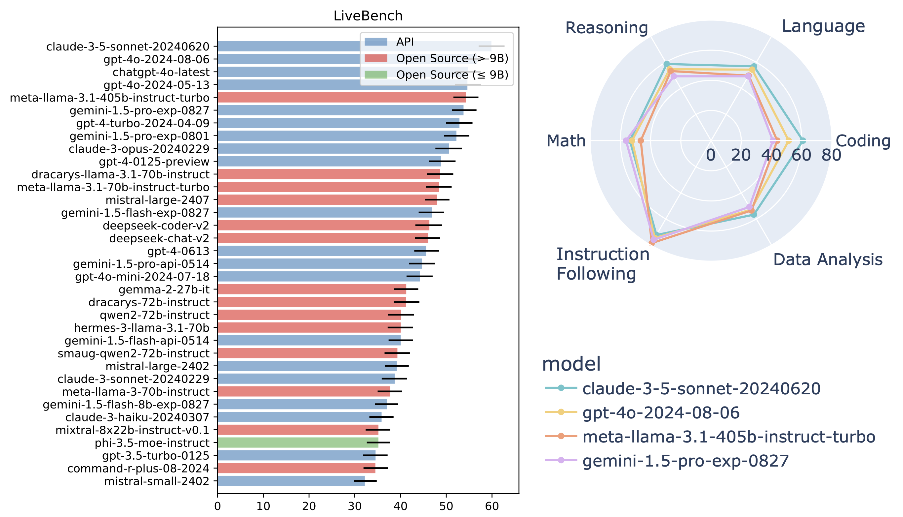

# LiveBench


<p align="center">
    <a href="https://livebench.ai/">🏆 Leaderboard</a> •
    <a href="https://huggingface.co/livebench">💻 Data </a> •
    <a href="https://livebench.ai/livebench.pdf">📝 Paper</a> 
</p>

Top models as of 30th August 2024 (see the full leaderboard [here](https://livebench.ai/)):



**Update 28th July 2024:** The first monthly update. We added 50 questions in a new spatial reasoning task, 28 additional coding generation questions, and 12 additional coding completion questions. In addition, we merged one of the optional dependencies in pyproject.toml into the main dependency stream to solve an issue experienced when using `gen_api_answer.py` without installing packages such as torch.

## Table of Contents

- [Introduction](#introduction)
- [Installation Quickstart](#installation-quickstart)
- [Usage](#usage)
- [Data](#data)
- [Adding New Questions](#adding-new-questions)
- [Documentation](#documentation)
- [Citation](#citation)

## Introduction

Introducing LiveBench: a benchmark for LLMs designed with test set contamination and objective evaluation in mind.

LiveBench has the following properties:

* LiveBench is designed to limit potential contamination by releasing new questions monthly, as well as having questions based on recently-released datasets, arXiv papers, news articles, and IMDb movie synopses.
* Each question has verifiable, objective ground-truth answers, allowing hard questions to be scored accurately and automatically, without the use of an LLM judge.
* LiveBench currently contains a set of 18 diverse tasks across 6 categories, and we will release new, harder tasks over time.

**We will evaluate your model!** Open an [issue](https://github.com/LiveBench/LiveBench/issues) or email us at [livebench.ai@gmail.com](mailto:livebench.ai@gmail.com)!

## Installation Quickstart

Tested on Python 3.10

To generate answers with API models (i.e. with gen_api_answer.py), conduct judgments, and show results:

```bash
cd LiveBench
pip install -e .
```

To do all of the above and also generate answers with local GPU inference on open source models (i.e. with gen_model_answer.py):
```bash
cd LiveBench
pip install -e .[flash_attn]
```

**Note about fschat**: The fschat package version on pip (i.e., [lmsys/fastchat](https://github.com/lm-sys/FastChat)) is currently out of date, so we strongly recommend `pip uninstall fschat` before running the above, since it will then automatically install a more recent commit of fastchat.

Our repo is adapted from FastChat's excellent [llm_judge](https://github.com/lm-sys/FastChat/tree/main/fastchat/llm_judge) module, and it also contains code from [LiveCodeBench](https://github.com/LiveCodeBench/LiveCodeBench) and [IFEval](https://github.com/Rohan2002/IFEval?tab=readme-ov-file).

## Usage

```bash
cd livebench
```

To generate model answers on LiveBench, run:
```bash
python gen_model_answer.py --model-path /path/to/Mistral-7B-Instruct-v0.2/ --model-id Mistral-7B-Instruct-v0.2 --dtype bfloat16 --bench-name live_bench
```

For API-based models, first set the appropriate key and then run the `gen_api_answer.py`. We currently support the following APIs: OpenAI, Anthropic, Mistral, Cohere, and Gemini. The command to run all of LiveBench on an `api_model_name`, run this command. Note: In a Windows terminal you'd use `set` instead of `export`:
```bash
export OPENAI_API_KEY=<your_key>
export ANTHROPIC_API_KEY=<your_key>
export MISTRAL_API_KEY=<your_key>
export CO_API_KEY=<your_key>
export GEMINI_API_KEY=<your_key>
export DEEPSEEK_API_KEY=<your_key>
python gen_api_answer.py --model <api_model_name> --bench-name live_bench
```

To generate model answers with VLLM or other arbitrary APIs matching the OpenAI API format, run:
```bash
export LIVEBENCH_API_KEY=<your API key if needed. Usually not needed for VLLM>
python gen_api_answer.py --model <api_model_name> --bench-name live_bench --api-base <your endpoint. Often, for VLLM, this is http://localhost:8000/v1>
```

To score the model outputs:

```bash
python gen_ground_truth_judgment.py --bench-name live_bench
```

To show all the results:
```bash
python show_livebench_result.py
```

You may want to run these commands on just some models. To run any of the above python files (`gen_model_answer.py`, `gen_api_answer.py`, `gen_ground_truth_judgment`, or `show_livebench_result.py`) for specific models, use the following argument styles:
```bash
python gen_model_answer.py          --bench-name live_bench --model-path /path/to/Mistral-7B-Instruct-v0.2/ --model-id Mistral-7B-Instruct-v0.2 --dtype bfloat16 
python gen_api_answer.py            --bench-name live_bench --model gpt-4-turbo
python gen_ground_truth_judgment.py --bench-name live_bench --model-list Mistral-7B-Instruct-v0.2 Llama-2-7b-chat-hf claude-3-opus-20240229
python show_livebench_result.py    --bench-name live_bench --model-list Mistral-7B-Instruct-v0.2 Llama-2-7b-chat-hf claude-3-opus-20240229
```

Or, you may want to show results for a specific category or task of LiveBench by using the `--bench-name` argument. Here, we run `show_livebench_result.py` on just the `web_of_lies_v2` task: 
```bash
python show_livebench_result.py --bench-name live_bench/reasoning/web_of_lies_v2
```

By default, any of the above scripts will use all livebench questions so far released. None of the livebench questions have yet been officially deprecated/excluded. You can optionally specify the `--livebench-releases` arg to restrict the questions you use to added in specific releases.

To use all questions:
```bash
python gen_api_answer.py --bench-name live_bench --model gpt-4-turbo --livebench-releases 2024-07-26 2024-06-24
```

To use only the questions from the July 2024 update:
```bash
python gen_api_answer.py --bench-name live_bench --model gpt-4-turbo --livebench-releases 2024-07-26
```

To optionally download `question.jsonl` files (for inspection) and answer/judgment files from the leaderboard, use
```bash
python download_questions.py
python download_leaderboard.py
```

To use `question.jsonl` files instead of huggingface, set `--question-source jsonl` on `gen_api_answer.py`, `gen_model_answer.py`, and `gen_ground_truth_judgment.py`. This is also a useful feature if you want to tweak the question jsonls or experiment with your own questions.

## Data
The questions for each of the categories can be found below:
- [Reasoning](https://huggingface.co/datasets/livebench/reasoning)
- [Math](https://huggingface.co/datasets/livebench/math)
- [Coding](https://huggingface.co/datasets/livebench/coding)
- [Language](https://huggingface.co/datasets/livebench/language)
- [Data Analysis](https://huggingface.co/datasets/livebench/data_analysis)
- [Instruction Following](https://huggingface.co/datasets/livebench/instruction_following)

Also available are the [model answers](https://huggingface.co/datasets/livebench/model_answer) and the [model judgments](https://huggingface.co/datasets/livebench/model_judgment).

## Adding New Questions
If you want to create your own set of questions, or try out different prompts, etc, follow these steps:

- Create a `question.jsonl` file with the following path: `livebench/data/live_bench/<category>/<task>/question.jsonl`. For example, `livebench/data/reasoning/web_of_lies_new_prompt/question.jsonl`. Here is an example of the format for `question.jsonl` (it's the first few questions from [web_of_lies_v2](https://huggingface.co/datasets/livebench/reasoning)):

```jsonl
{"question_id": "0daa7ca38beec4441b9d5c04d0b98912322926f0a3ac28a5097889d4ed83506f", "category": "reasoning", "ground_truth": "no, yes, yes", "turns": ["In this question, assume each person either always tells the truth or always lies. Tala is at the movie theater. The person at the restaurant says the person at the aquarium lies. Ayaan is at the aquarium. Ryan is at the botanical garden. The person at the park says the person at the art gallery lies. The person at the museum tells the truth. Zara is at the museum. Jake is at the art gallery. The person at the art gallery says the person at the theater lies. Beatriz is at the park. The person at the movie theater says the person at the train station lies. Nadia is at the campground. The person at the campground says the person at the art gallery tells the truth. The person at the theater lies. The person at the amusement park says the person at the aquarium tells the truth. Grace is at the restaurant. The person at the aquarium thinks their friend is lying. Nia is at the theater. Kehinde is at the train station. The person at the theater thinks their friend is lying. The person at the botanical garden says the person at the train station tells the truth. The person at the aquarium says the person at the campground tells the truth. The person at the aquarium saw a firetruck. The person at the train station says the person at the amusement park lies. Mateo is at the amusement park. Does the person at the train station tell the truth? Does the person at the amusement park tell the truth? Does the person at the aquarium tell the truth? Think step by step, and then put your answer in **bold** as a list of three words, yes or no (for example, **yes, no, yes**). If you don't know, guess."], "task": "web_of_lies_v2"}
{"question_id": "9ee37b9a04ab050936c86b2c5bb7abbaa0bc0e737d59a7bff9ba11e9b4069c1d", "category": "reasoning", "ground_truth": "yes, no, yes", "turns": ["In this question, assume each person either always tells the truth or always lies. Liam is at the movie theater. The person at the beach says the person at the restaurant tells the truth. Kehinde is at the aquarium. The person at the amusement park saw a firetruck. The person at the aquarium tells the truth. Luna is at the library. Jaxon is at the amusement park. The person at the amusement park says the person at the beach tells the truth. Anika is at the restaurant. The person at the barbershop tells the truth. The person at the observatory says the person at the planetarium lies. Hiroshi is at the beach. Isabella is at the planetarium. Nia is at the barbershop. The person at the movie theater says the person at the observatory lies. The person at the restaurant tells the truth. Max is at the observatory. The person at the library says the person at the amusement park tells the truth. The person at the planetarium says the person at the library tells the truth. Does the person at the movie theater tell the truth? Does the person at the observatory tell the truth? Does the person at the planetarium tell the truth? Think step by step, and then put your answer in **bold** as a list of three words, yes or no (for example, **yes, no, yes**). If you don't know, guess."], "task": "web_of_lies_v2"}
{"question_id": "d7071c9ff5d9779e7ab955366d0ae8db40f785aadfe7ff0b5a7ede98c05c44ea", "category": "reasoning", "ground_truth": "no, no, yes", "turns": ["In this question, assume each person either always tells the truth or always lies. Liam is at the restaurant. The person at the observatory says the person at the botanical garden lies. Elowen is at the vineyard. The person at the library says the person at the botanical garden tells the truth. The person at the train station tells the truth. The person at the botanical garden saw a firetruck. The person at the botanical garden says the person at the train station lies. Jake is at the aquarium. Soren is at the farm. Theo is at the gym. The person at the train station saw a firetruck. Devika is at the train station. Kehinde is at the library. The person at the restaurant lies. The person at the farm says the person at the train station lies. The person at the gym says the person at the train station lies. Hiroshi is at the botanical garden. The person at the vineyard lies. The person at the aquarium says the person at the library tells the truth. Quan is at the observatory. Does the person at the library tell the truth? Does the person at the botanical garden tell the truth? Does the person at the train station tell the truth? Think step by step, and then put your answer in **bold** as a list of three words, yes or no (for example, **yes, no, yes**). If you don't know, guess."], "task": "web_of_lies_v2"}
{"question_id": "92bb60ed8fe8f01ae8ed962c504f73b598e541a89fcb2d800685230220f44bd8", "category": "reasoning", "ground_truth": "yes, no, no", "turns": ["In this question, assume each person either always tells the truth or always lies. The person at the theater says the person at the airport lies. The person at the barbershop says the person at the school tells the truth. Hiroshi is at the school. Ryan is at the airport. Zara is at the botanical garden. The person at the train station tells the truth. Jake is at the observatory. The person at the airport thinks their friend is lying. Theo is at the theater. The person at the botanical garden says the person at the aquarium lies. Liam is at the train station. Grace is at the bowling alley. The person at the airport says the person at the bowling alley lies. Olivia is at the amusement park. The person at the observatory tells the truth. Elowen is at the aquarium. Farid is at the art gallery. The person at the airport says the person at the beach tells the truth. The person at the art gallery says the person at the barbershop lies. The person at the bowling alley says the person at the art gallery lies. Soren is at the barbershop. The person at the school tells the truth. The person at the aquarium says the person at the airport tells the truth. The person at the botanical garden saw a firetruck. The person at the bowling alley says the person at the amusement park tells the truth. The person at the airport saw a firetruck. Ayaan is at the beach. Does the person at the botanical garden tell the truth? Does the person at the aquarium tell the truth? Does the person at the airport tell the truth? Think step by step, and then put your answer in **bold** as a list of three words, yes or no (for example, **yes, no, yes**). If you don't know, guess."], "task": "web_of_lies_v2"}
{"question_id": "36febbb33b3d28b8f75e1a7f798fcff09903e94a50b89da2dbf1ed160508c02c", "category": "reasoning", "ground_truth": "yes, yes, yes", "turns": ["In this question, assume each person either always tells the truth or always lies. Beatriz is at the vineyard. The person at the city hall says the person at the school lies. The person at the ice skating rink says the person at the school tells the truth. Quan is at the ice skating rink. The person at the amusement park says the person at the school tells the truth. Olivia is at the restaurant. The person at the vineyard says the person at the botanical garden tells the truth. The person at the vineyard says the person at the campground tells the truth. Charlie is at the campground. Soren is at the school. Grace is at the barbershop. The person at the school says the person at the vineyard tells the truth. The person at the barbershop says the person at the campground tells the truth. Mateo is at the amusement park. Tala is at the botanical garden. The person at the campground tells the truth. The person at the restaurant tells the truth. Devika is at the city hall. The person at the amusement park thinks their neighbor is telling the truth. The person at the amusement park thinks their friend is lying. Does the person at the amusement park tell the truth? Does the person at the school tell the truth? Does the person at the vineyard tell the truth? Think step by step, and then put your answer in **bold** as a list of three words, yes or no (for example, **yes, no, yes**). If you don't know, guess."], "task": "web_of_lies_v2"}
```

- Create a new scoring method in the `process_results` folder. If it is similar to an existing task, you can copy that task's scoring function. For example, `livebench/process_results/reasoning/web_of_lies_new_prompt/utils.py` can be a copy of the `web_of_lies_v2` scoring method.
- Add the scoring function to `gen_ground_truth_judgment.py` [here](https://github.com/LiveBench/LiveBench/blob/93e3a7d4fa5bb164ef4cb58f67683e4e54554af9/livebench/gen_ground_truth_judgment.py#L124).

- Run and score models using the `question-source jsonl` and specifying your task. For example: 
```bash 
python gen_api_answer.py --bench-name live_bench/reasoning/web_of_lies_new_prompt --model claude-3-5-sonnet-20240620 --question-source jsonl
python gen_ground_truth_judgment.py --bench-name live_bench/reasoning/web_of_lies_new_prompt --question-source jsonl
python show_livebench_result.py --bench-name live_bench/reasoning/web_of_lies_new_prompt
```

## Documentation
Here, we describe our dataset documentation. This information is also available in our paper.
- [Author Responsibility](docs/AUTHOR_RESPONSIBILITY.md)
- [Code of Conduct](docs/CODE_OF_CONDUCT.md)
- [Contributing](docs/CONTRIBUTING.md)
- [Datasheet for LiveBench](docs/DATASHEET.md)
- [Maintenance Plan](docs/MAINTENANCE_PLAN.md)

## Citation

```bibtex
@article{livebench,
  author    = {White, Colin and Dooley, Samuel and Roberts, Manley and Pal, Arka and Feuer, Ben and Jain, Siddhartha and Shwartz-Ziv, Ravid and Jain, Neel and Saifullah, Khalid and Naidu, Siddartha and Hegde, Chinmay and LeCun, Yann and Goldstein, Tom and Neiswanger, Willie and Goldblum, Micah},
  title     = {LiveBench: A Challenging, Contamination-Free LLM Benchmark},
  url       = {arXiv preprint arXiv:2406.19314},
  year      = {2024},
}
```
